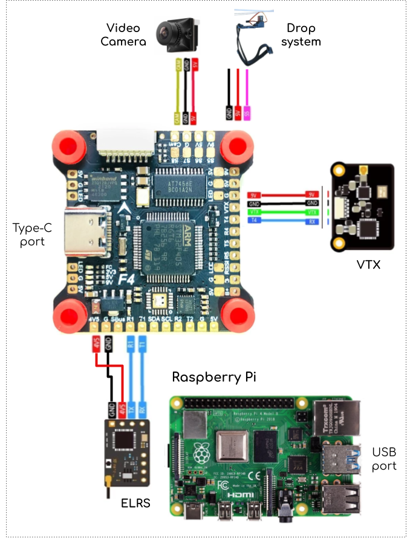
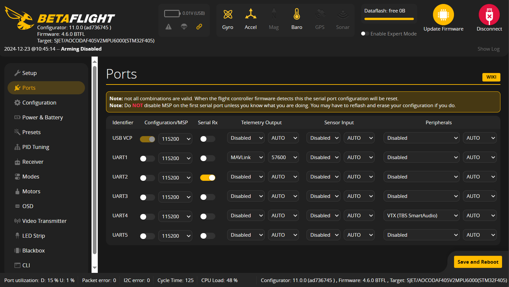
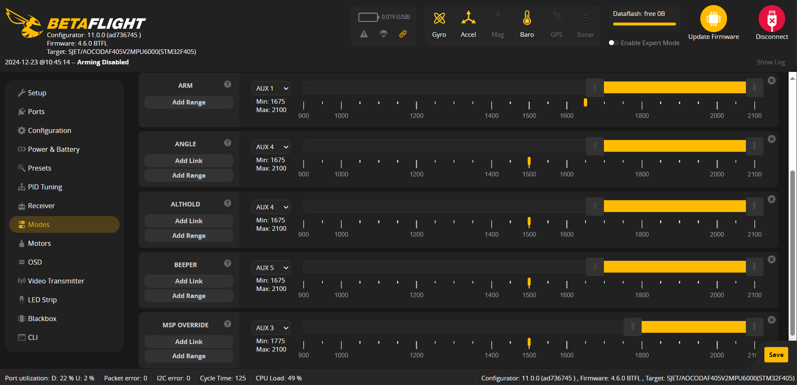
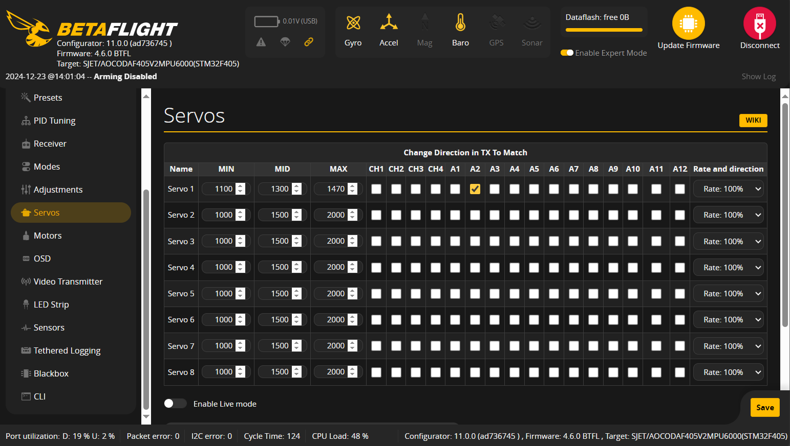
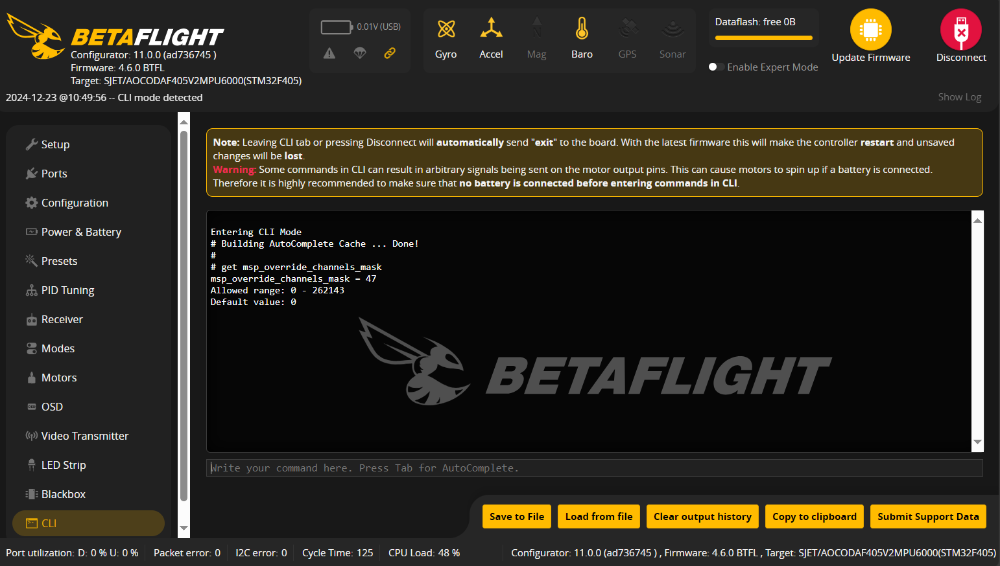
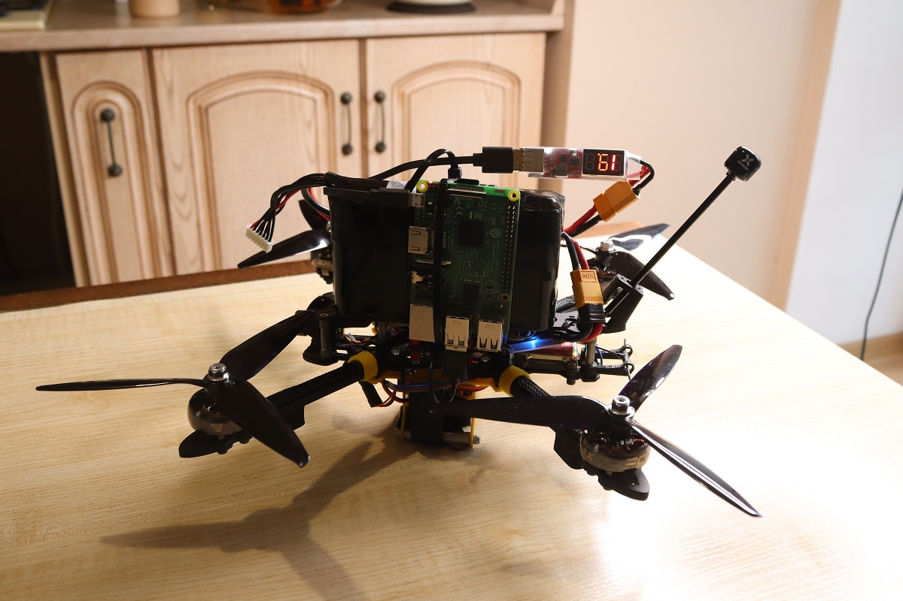

# Autopilot for FPV Combat Drone on Betaflight (Empty version)

## Autopilot "BEE EMPTY"
The "BEE EMPTY" autopilot, designed for installation on a companion computer connected to an FPV combat drone, provides basic autonomous functionality. It `enables the drone to fly forward for 2 seconds and then release its payload (bomb)`. This **`"empty system"`** serves as a development template and is ideal for autopilot developers looking to kickstart their own projects, particularly those aimed at implementing target-following capabilities based on computer vision or developing features to avoid interferences during FPV drone flight. This is not a final solution but a good start for devs.

This code is largely adapted from another repository, [Autopilot with Target Following for FPV Combat Drone (Simulator version)](https://github.com/under0tech/autopilot_bee_sim), but is designed to work on real hardware, specifically a Raspberry Pi mounted on an FPV drone with [Betaflight firmware](https://app.betaflight.com) pre-installed. 

This **`"empty version"`** has certain limitations, as features like computer vision, target following, and anti-drone system detection are not implemented.

### MODES:
`OFF`  -  autopilot remains inactive, awaiting operator input to switch to another mode. During this state, only telemetry monitoring and logging are active.

`READY`  -  Activates basic functionality, where the drone flies forward for 2 seconds and releases its payload (e.g., a bomb).

## FPV Drone Configuration
For the purposes of this template, I am using the **Aocoda F460 Stack**, a top-tier flight control system that includes the `Aocoda F405 v2 Flight Controller (FC)` and the `3060S (60A) Electronic Speed Controller (ESC)`. The wiring diagram in the image below shows the components, such as a servo module, video camera, VTX, ELRS receiver, and Raspberry Pi, which are connected to the FC.



The flight controller connects to its ESC via an 8-pin wire, which requires no further explanation.

The diagram above shows the connections between various components and the Aocoda F405 flight controller. These components include a video camera, drop system, VTX (video transmitter), ELRS (ExpressLRS) receiver, and a Raspberry Pi (acting as a companion computer). Below are the specific wiring details for each component:
- **Video Camera**: yellow (CAM), red (5V), and black (GND)
- **Drop System**: red (5V), black (GND), and pink (S5). S5 is associated with SERVO1 on the FC.
- **VTX**: red (9V), black (GND), green (VTX), and blue (T4). Pin T4 (TX on UART 4) connects to appropriate RX on the Video transmitter.
- **ELRS Receiver**: red (4.5V), black (GND), blue (T2), and blue (R2). T2 and R2 on the FC associates with UART2 and connects to opposite pins on the ELRS receiver. T2 to RX and R2 to TX.
- **Raspberry Pi (RPi)**: Type-C to USB cable connects FC with Raspberry Pi (for MSP protocol).

More details on soldering components and building FPV drone from scratch you can find in the article ["How to Build an FPV Combat Drone to Defend Your Country"](https://medium.com/@dmytrosazonov/how-to-build-an-fpv-combat-drone-for-military-purposes-ce549f24efca).

## Betaflight Configuration
[Betaflight Configurator](https://app.betaflight.com) is an essential tool for configuring your FPV drone. While I won't be providing all the specific settings required for your FPV drone — those are detailed in the article mentioned above. In this section, I am covering the essential settings you need to adjust in `Betaflight Configurator` to ensure compatibility with the source code provided in this repository.

1. Make sure to properly configure your ports. Pay special attention to the `Rx port` corresponding to the receiver, the `VTX` in the peripherals section, and ensure the standard USB port is reserved for `'Configuration/MSP'`, as shown in the image below.

   
2. Ensure you have configured all the necessary modes listed below: `ARM`, `ANGLE`, `ALTHOLD`, `BEEPER`, and `MSP OVERRIDE`, assigning each to the appropriate AUX channel on your radio controller.

   `ARM` - Used for arming and disarming the motors.

   `ANGLE` -  Enables ANGLE mode, allowing the autopilot control drone in stabilized mode.

   `ALTHOLD` - Maintains the current altitude, preventing altitude loss during flight.

   `BEEPER` - Activates a beeper on the drone, helpful for locating drone in case of an emergency, such as losing it in a wooded area.

   `MSP OVERRIDE` - The most important mode, used to grant autopilot control through toggles set in the **`msp_override_channels_mask`** variable. See below the details.

   
3. Ensure you have the servo module properly set up. As shown in the image below, I have configured SERVO1 to respond to AUX2 toggling. You should do the same in your setup. For detailed instructions on how to configure the servo, refer to the article I mentioned earlier: ["How to Build an FPV Combat Drone to Defend Your Country"](https://medium.com/@dmytrosazonov/how-to-build-an-fpv-combat-drone-for-military-purposes-ce549f24efca).

   
4. To enable the ability to add and configure the `MSP OVERRIDE` mode, you need to set the **`msp_override_channels_mask`** variable in the CLI. For purposis of this code, the mask value has been calculated as **`47`**, which corresponds to the bitmask **`00101111`**.

   To set it up, use the following commands:
   ```cli
   set msp_override_channels_mask = 47

   save

   get msp_override_channels_mask
   ```

   

Remember to save the configuration after each change by using the `save` command.

### MSP OVERRIDE
`MSP OVERRIDE` mode is a feature in Betaflight that allows the autopilot (RPi) to overwrite certain AUX values. When activated, this mode gives the autopilot control over the drone, allowing it to adjust parameters such as ROLL, PITCH, YAW, THROTTLE, and AUX values. We will use this mode to control the drone's direction, speed, overall flight, and to trigger the appropriate servo module associated with SERVO1 (AUX2) in our setup to release the bomb when necessary.

In Betaflight, the `msp_override_channels_mask` variable defines which channels on your transmitter (radio controller) will be overwritten by the autopilot. For the purposes of this repository, I have reserved the channels for overwriting ROLL, PITCH, YAW, THROTTLE for flight control, and `AUX2` (associated with the `SERVO1` module) to release the bomb. Note that the mask follows a reversed direction logic. See the image below for a better understanding of how this works and why I set the mask value to **`47 (0x00101111)`**.


`1` means the override is enabled, and `0` means it is disabled. As shown, we enable control for the first four channels intended for flight control (ROLL, PITCH, YAW, THROTTLE), as well as AUX2, which is responsible for releasing the bomb.

## Raspberry Pi Configuration
The Raspberry Pi (RPi) acts as a companion computer in our setup, communicating with the Betaflight firmware on the flight controller (FC) via the [MSP port/protocol](http://www.multiwii.com/wiki/index.php?title=Multiwii_Serial_Protocol). Although Betaflight is not originally designed for autonomous flights, recent releases introduced a powerful feature that enables the creation autopilots. This feature is called `MSP OVERRIDE` mode. This autopilot program leverages that mode to enable autonomous operation. 

Follow the instructions below to install the autopilot code on the RPi, which will allow you to run basic scenario of Autonomous Flight.

1. Download and extract this repository, including the `logs` folder, to the destination `/home/pi/bee-ept` on your Raspberry Pi device.
2. Copy the files `config/run_autopilot.service` and `config/run_autopilot.sh` to their destination `/etc/systemd/system`, and give them the necessary permissions by running the `sudo chmod +x run_autopilot.sh` command in the bash console.
3. Enable the Autopilot service to run automatically on RPi startup
   
   ```bash
   sudo systemctl enable run_autopilot.service
   reboot
   ```
4. Go to the `logs` folder, after its restart, and ensure that new files are being generated, indicating everything is working correctly. If not, check the `definitions.py` and adjust the settings as needed.

## How to Use
Once all the necessary settings and configurations are complete, it's time to test how everything behaves in real life. I recommend starting the test at home, without propellers, to verify that the scenario works—at the very least, ensure the motors attempt to change their rotation. When you are ready, move to a safe environment, attach the propellers, and proceed to test the next scenario.

- Check that toggling `AUX2` operates the closing mechanism in the servo module.
- Set up your payload and switch `AUX2` to the closed position.
- Arm the motors using `AUX1` and take off to a safe, observable altitude.
- When the altitude reaches 2m, press `AUX4` to hold the current altitude and switch to `ANGLE` mode. This will help the autopilot fly more safely.
- Move `AUX3` to the middle position and hold it there for a few seconds to allow the autopilot to initialize and prepare for autonomous flight.
- Move `AUX3` to the maximum position to enable `MSP OVERRIDE` mode. The autopilot will then fly forward for 2 seconds. Afterward, it will stop and automatically release the payload on SERVO1.
- At this point, you can take control of the FPV drone by toggling `AUX3` back to the minimal position (switched off) and prepare for landing.



## Customize this Autopilot
The primary objective of sharing this source code is to extend R&D programs related to automated combat drones within the developer community in Ukraine. This initiative aims to establish a strategic advantage on the frontline by implementing automated flight systems equipped with computer vision on widely-spread FPV drones to increase support for the Ukrainian army.

If you are a developer or possess programming skills, this code serves as a template for building your own autopilot compatible with [Betaflight firmware](https://app.betaflight.com). Start with this template and expand it by adding features such as computer vision, target tracking, cruise control, and more. For comprehensive developer instructions, look to [README_DEV.md](README_DEV.md).

By creating autopilots, initiating production, and supplying FPV drones to the Ukrainian army, you will actively #SupportUkraine.

## Troubleshooting
Be patient while soldering, building an FPV drone, and setting up the configuration in Betaflight and then in the Raspberry Pi (Rpi). There are plenty of pitfalls and possible issues that may require your attention and time to resolve. This is okay. It took me months to set up and test everything that you have now.

## Get in touch
Message me on Twitter if you have questions or need some clarifications.
https://twitter.com/dmytro_sazonov