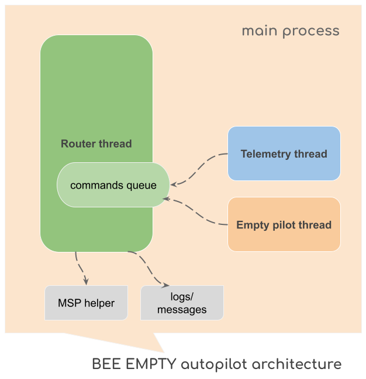

# Empty Autopilot for FPV Combat Drone on Betaflight (Guide for Developers)

## Architecture
The Autopilot "BEE EMPTY" has a multi-threaded architecture. At its core, it has a command queue and a command router which is responsible for processing all queued commands. The router operates within its own thread, called the `Router thread`, while two other processes — the `Telemetry thread` and the `Empty pilot thread` — simply append commands to the queue.



The `Telemetry thread` is responsible for queuing commands for system monitoring and telemetry requests. It supplies the Autopilot with essential data, including current altitude, aircraft speed, and the real-time values of RC channels. Telemetry requests are added to the queue every 2 seconds.

The `Empty pilot thread` is responsible for queuing commands related to payload delivery (e.g., bomb deployment). These commands are added to the queue every second.

During operation, the Autopilot utilizes the `MSP helper`, a set of functions designed to `request MSP data` and `execute MSP commands`. These [MSP commands](http://www.multiwii.com/wiki/index.php?title=Multiwii_Serial_Protocol) are used to control the FPV drone and its peripheral devices by leveraging the `MSP OVERRIDE` feature in Betaflight.

## main.py and threads
The `main.py` file is the primary entry point for launching the Autopilot. To ensure proper execution, follow the `RPi Configuration` guidelines provided in [README.md](README.md). Upon startup, it sets up the command queue, initializes the sub-processes (threads) described above, and enqueues the `INIT` command to begin the Autopilot initialization process.

## Autopilot state and settings
Autopilot has a few files which describes it initial state [autopilot.py](autopilot.py) and settings [definitions.py](definitions.py).
```python
state = {
    'connection' : False,
    'bee_state' : 'OFF', # OFF, READY
    'roll': 1500,
    'pitch': 1500,
    'yaw': 1500,
    'throttle': 1100,
    'aux1': 1000,
    'aux2': 1000,
    'aux3': 1000,
    'aux4': 1000,
    'battery': 0,
    'rssi':0,
    'rssi_msg':'No signal',
    'speed': 0,
    'altitude': 0,
    'delivered': False
}
```
The `Autopilot state`, as listed above, is utilized for Autopilot operations and encompasses vital parameters that can be changed during program execution.

- **`connection`**: Indicates the connection status with the FPV Drone. Initially set to `False` upon establishment of the connection.
- **`bee_state`**: Represents the current mode of operation, which can be set to one of the following states: `OFF` or `READY`. For more details, refer to the introduction section of [README.md](README.md).
- **`roll`**, **`pitch`**, **`yaw`**, **`throttle`**, **`aux1`**, **`aux2`**, **`aux3`**, **`aux4`**: Represent the current values of the basic RC channels.
- **`battery`**: Displays the current battery voltage.
- **`rssi`** and **`rssi_msg`**: Show the current RC signal strength and its corresponding text caption.
- **`speed`** and **`altitude`**: Reflect the current speed and altitude of the drone, respectively.
- **`delivered`**: Indicates whether the bomb (payload) has been released. Initially set to `False` until the payload is delivered.

```python
companion_computer = '/dev/ttyACM0' # COM3 (for Windows)
companion_baud_rate = 115200
logger_name = 'BEE-EPT-UA913'
logger_directory = '/home/pi/bee_ept/logs'  # logs (for Windows) 

default_roll = 1500
default_pitch = 1500
default_yaw = 1500
default_throttle = 1000
default_servo_aux2 = 1000
```

The `Autopilot settings` outlined above are used for Autopilot operations. They include configurations for default RC values in `MSP OVERRIDE` mode, log file path, connection parameters, and more.

- **`companion_computer`**: Defines the communication port on the Raspberry Pi used to connect with the Flight Controller (FC).
- **`companion_baud_rate`**: Specifies the baud rate of the COM port used for communication.
- **`logger_name`**: Sets the name of the logger associated with the Autopilot, such as `'BEE-EPT-UA913'`.
- **`logger_directory`**: Specifies the directory path where log files are stored.
- **`default_roll`**, **`default_pitch`**, **`default_yaw`**, **`default_throttle`**, and **`default_servo_aux2`**: Define the initial values for RC channels utilized by the `MSP OVERRIDE` feature when the Autopilot gains control on flight operations.

## Messages and logger
The application includes predefined messages for various situations and a list of designated targets to receive notifications. Messages can be directed to the application console, the log file, or both simultaneously. This functionality is implemented in [messages.py](messages.py). Additionally, [logger.py](logger.py) handles logging messages into a log file, which is useful for analyzing Autopilot flight operations.

Logs (**LOG files**) are saved in the `Logs` directory.

## MSP commands
Communication between the companion computer (Autopilot) and the FPV Combat Drone is managed through `MSP commands`, which are defined in the [commands.py](commands.py) file. These commands handle various functions, including telemetry requests, system monitoring, as well as controlling the drone's movement and delivering the payload (bomb).

Each command typically has an associated delay period, indicating the time the system router must wait before executing the next command. These delays are specified within the `command_delays` object.

## Router
As described in the `Architecture` section, the [router](router.py) (also known as the `Command Executor`) is the central component of the application, responsible for managing all commands added to the command queue. Currently, it recognizes the following list of commands:
```python
commands = {
    'INIT': command_init,
    'MONITOR': command_monitor,
    'TELEMETRY': command_telemetry,
    'DELIVER':command_deliver,
}
```

- **INIT**: Initializes the FPV Drone.
- **MONITOR**: Retrieves system status from the FPV Drone, including battery voltage.
- **TELEMETRY**: Fetches the current speed and altitude, as well as the current values of `RC channels`.
- **DELIVER**: Initiates the delivery scenario for the **Empty Autopilot** (2 seconds forward and payload delivery).

Each command method contains embedded logic, sends messages to designated targets, and executes the appropriate MSP commands.

## MSP Helper
The Autopilot utilizes the `MSP OVERRIDE` feature in Betaflight, which is based on the MSP protocol described in the [MSP Protocol documentation](http://www.multiwii.com/wiki/index.php?title=Multiwii_Serial_Protocol). The [MSP helper](msp_helper.py) provides a convenient interface for sending MSP requests and commands, retrieving MSP responses, and handling the checksum for each message.

## What you can do with this Autopilot?
This `Empty version` is designed as an initial template to kickstart your own R&D program for **autonomous FPV Combat drones**. By contributing to #SupportUkraine, you can enhance this FPV autopilot with computer vision and target-following capabilities. Here's what you can do to achieve that:
- Explore the initial autopilot template to understand its structure and approaches.
- Create your own `computer vision model` to recognize targets such as **tanks, soldiers, and more**. For details, check out the article [DIY for a Spy: Utilizing YOLOv8 Object Detection in Military Operations](https://medium.com/@dmytrosazonov/diy-for-a-spy-utilizing-yolov8-object-detection-in-military-operations-053d787b6f62).
- Build `FPV goggles overlay` grabbing AV output from the FPV camera, analyze the video on a Raspberry Pi, and transmit the altered video feed to the Flight Controller (FC). This will allow you to get imagery for object detection and overlay operational messages. Check the [Video-overlay feature for RPi](https://gist.github.com/under0tech/6360ffea697f2f2f9f8d0d5b70148ef0).
- Develop your `target-following feature` and integrate it into your autopilot. For an example, refer to the article [How to Build an Autopilot with Computer Vision and Target Following for FPV Combat Drone](https://medium.com/@dmytrosazonov/how-to-build-an-autopilot-with-computer-vision-and-target-following-for-fpv-combat-drone-3544f482baae).
- Test the final device, document its usage, and send it to the **Ukrainian army** for use in combat operations.

## Get in touch
Text me on Twitter if you have any related questions.
https://twitter.com/dmytro_sazonov
